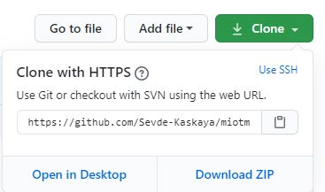
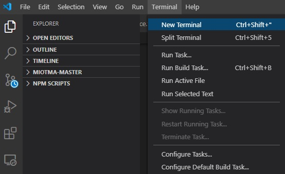
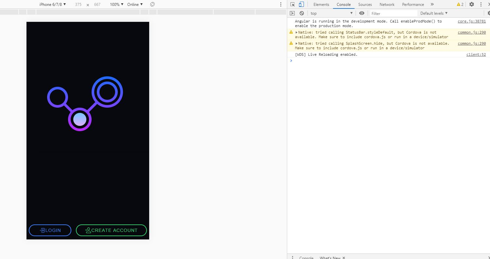

#Mobil IoT Yönetimi Kullanım Kılavuzu


**Gerekli kurulumlar:**

   1. Editör olarak Visual Studio Code indirilir.


   2. npm paketlerini yönetebilmek için node.js uygulaması indirilir.


   3. Angular CLI kurulumu için bilgisayardan Komut İstemi üzerinden angular/cli indirilir.
   ```
   C:\Users\user>npm install -g @angular/cli
   ```

   4. Ionic Framework’ünü kurmak için Komut İstemi uygulamasından ionic cordova indirilir.
   ```
   C:\Users\user>npm install -g ionic cordova
   ```


**Projenin locale alınması işlemleri:** 
   1. Github’tan proje dosyasını indirebilmek için Github’tan proje dosyası açımalı ve “Clone or Download” butonuna tıklayarak orada bulunan proje linki kopyalanır. 

   
             
   2. Bilgisayarın Komut İstemi uygulaması açılıp projenin bulunması istenilen konuma giderek aşağıdaki kod çalıştırılır
   ```
   C:\Users\<user>\Desktop> git clone https://github.com/Sevde-Kaskaya/miotma.git” 
   ```

   3. Clone işlemi tamamlandıktan sonra projenin bulunduğu dizinde aşağıdaki kod çalıştırılarak proje VS Code üzerinde açılır.
   ```
   C:\Users\<user>\Desktop\miotma> code .
   ```

   4. VS Code içinde yeni terminal açılır.

   

   5. VS Code terminalinde  modülleri aktif hale getirebilmek için aşağıdaki komut çalıştırılır.
   ```
   C:\Users\user\Desktop\miotma> npm -i
   ```

   6. VS Code terminalinde tablo ve grafik kütüphanesini kurulur.
   ```
   C:\Users\user\Desktop\miotma> npm install chart.js --save
   ```

   7. Kod ionic ile çalıştırılır.
   ```
   C:\Users\user\Desktop\miotma> ionic serve
   ```

   

Bu işlemlerin sonucunda proje bilgisayarda çalışabilir hale gelmiş olur.

